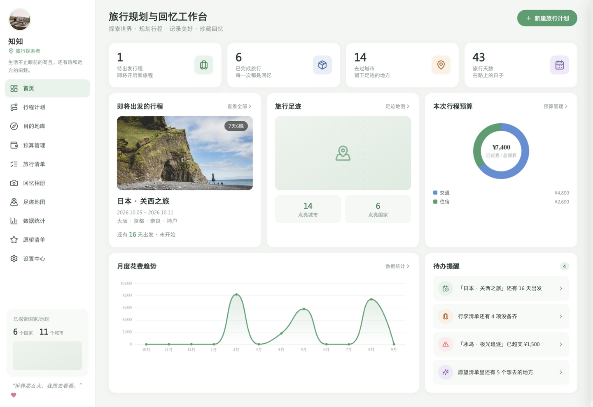
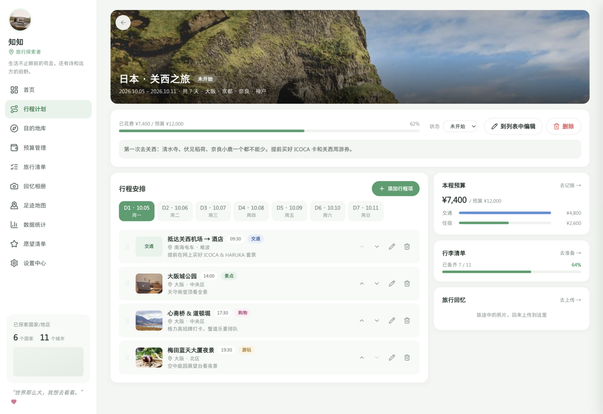
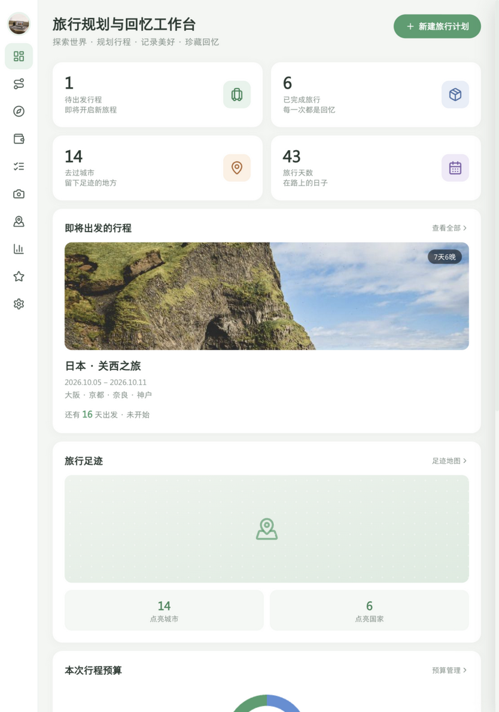
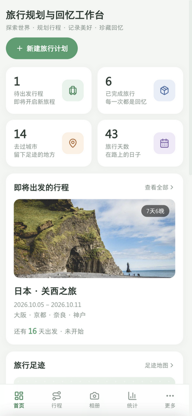
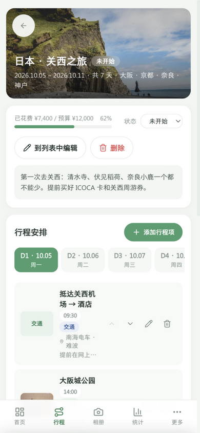

# 旅行规划与回忆工作台 ✈️

一个纯前端的个人旅行工作台：规划行程、记录花费、整理照片、点亮足迹。所有数据保存在浏览器本地（IndexedDB），无后端、无账号，支持一键导出 / 导入 JSON 备份。

> 视觉风格取自设计示例页（已备份到 `docs/design-reference.html`），演示数据沿用示例中的「日本 · 关西之旅」「圣托里尼」「冰岛极光」等设定，首次打开即有完整效果。

## 三端自适应效果

| PC（≥1024px） | Pad（640~1024px） | 手机（<640px） |
| --- | --- | --- |
| 侧边栏 232px；统计卡 4 列；照片墙 5 列；行程/足迹/预算三列并排 | 侧边栏收起为 64px 图标条；统计卡 2 列；照片墙 3 列 | 侧边栏隐藏，底部 TabBar +「更多」面板；统计卡 2 列；照片墙 2 列；天标签横向滚动 |





| Pad 端 | 手机端 |
| --- | --- |
|  |  |

| 手机端行程详情（天标签横向滚动 + 时间线） |
| --- |
|  |

## 功能模块

| 模块 | 说明 |
| --- | --- |
| 仪表盘 | 待出发 / 已完成 / 去过城市 / 旅行天数统计卡、即将出发行程卡、预算环图、月度趋势折线、自动生成的待办提醒 |
| 旅行计划 | 行程 CRUD（名称、起止日期、目的地列表、预算、封面、备注、状态：未开始/进行中/已完成），删除行程级联清理日程/花费/清单/回忆 |
| 行程安排 | 按天编排，每天多个行程项（时间、地点、类型、备注、图片）；时间线视图；拖拽排序（PC/Pad）+ 上下移按钮（手机）；行程项可跨天移动 |
| 目的地库 | 卡片（国家/城市、去过/想去、最佳时间、星级评分、图片、笔记）+ 状态筛选 + 搜索 |
| 预算管理 | 按行程按分类（交通/住宿/餐饮/景点/购物/其他）记账；环图 + 明细列表；预算 vs 实际进度对比（超支变红提醒） |
| 旅行清单 | 可复用清单模板 + 按行程勾选；完成度环形进度；一键应用模板；清除已勾选项 |
| 回忆相册 | 照片墙按行程分组（手机 2 列 / Pad 3 列 / PC 5 列）；多张批量上传（本地压缩 ≤2MB）；说明文字与日期；大图灯箱（左右切换、就地编辑说明） |
| 足迹地图 | 中国地图打点（到访次数越多光点越大）、点亮城市/国家统计、海外足迹列表、点击光点查看城市详情与相关行程 |
| 数据统计 | 今年 / 近三年 / 全部切换（按月/季/年分桶）；次数、天数、花费、人均 KPI；柱线组合图 + 分类占比环图 |
| 愿望清单 | 想去 / 已去 / 放弃状态流转，标记已去有正反馈 Toast |
| 设置 | 个人资料（昵称 / 头像 / 标签 / 签名）、导出 JSON、导入 JSON、清空数据（二次确认） |

通用体验：手机底部弹出的 Bottom Sheet / PC 右侧 Drawer 双形态抽屉、表单校验（必填、开始 < 结束日期、金额非负）、空状态引导、成功/失败/确认 Toast、所有删除二次确认、路由切换过渡动画、移动端触控区 ≥44px。

## 技术栈

- Vue 3（Composition API + `<script setup>`）+ Vite 5 + JavaScript
- Tailwind CSS 3（响应式全部使用 `sm/md/lg/xl` 前缀，无手写媒体查询）
- Pinia（9 个业务 store）+ Vue Router 4
- ECharts 5（vue-echarts，按需注册；`autoresize` 基于 ResizeObserver，容器变化自动重绘）
- localforage（IndexedDB 持久化）
- lucide-vue-next 内联 SVG 图标（全站无 emoji 图标）

## 快速开始

```bash
npm install     # 安装依赖
npm run dev     # 开发模式，默认 http://localhost:5173
```

其他命令：

```bash
npm run build     # 产物输出到 dist/，可静态部署
npm run preview   # 本地预览构建产物
npm run lint      # ESLint 检查
npm run format    # Prettier 格式化
```

> 地图、图片全部为本地资源，安装依赖后离线也能完整运行。

## 数据与备份

- **存储位置**：浏览器 IndexedDB（数据库名 `travel-workbench`），关闭浏览器不会丢失。
- **演示数据**：首次打开自动写入「日本 · 关西之旅」等演示数据；在「设置 → 数据管理 → 清空数据」后不会再次写入。
- **导出**：设置 → 导出 JSON，得到包含全部行程、日程、花费、清单、回忆（图片为 dataURL）和设置的备份文件。
- **导入**：设置 → 导入 JSON，选择之前导出的文件，二次确认后整体覆盖当前数据。
- **照片**：上传时在本地 Canvas 压缩（最长边 1920、逐级降质），成品控制在 2MB 以内，随 JSON 一起导出。

## 目录结构

```
├── index.html                  # Vite 入口（含启动 loading）
├── public/demo/                # 演示图片（来自设计示例的 assets）
├── docs/design-reference.html  # 原设计示例页备份
├── screenshots/                # 三端效果图
└── src/
    ├── main.js                 # 入口：注册 Pinia/Router/ECharts，数据初始化后再挂载
    ├── style.css               # Tailwind 入口 + 设计系统组件类（btn/input/chip/card…）
    ├── App.vue                 # 外壳：侧边栏 / 图标条 / TabBar + 全局弹层
    ├── router/                 # 路由表 + 导航配置（侧边栏/TabBar 共用）
    ├── stores/                 # Pinia：trips / itinerary / destinations / expenses
    │                           #        packing / memories / wishlist / settings / ui
    │                           #        persist.js（IndexedDB 自动持久化）、index.js（初始化/导入/导出）
    ├── utils/                  # storage（localforage）/ date / format / image（压缩）
    │                           #        placeholder（SVG 占位插画）/ geo（城市经纬度）/ charts（ECharts 主题）
    ├── components/
    │   ├── layout/             # AppSidebar（PC 全宽/Pad 图标条）、AppTabBar、MoreSheet
    │   ├── ui/                 # BaseDrawer、ConfirmDialog、ToastHost、StatCard、ChartCard、
    │   │                       # EmptyState、ImageUploader、StarRating、PageHeader
    │   ├── TripForm.vue        # 行程表单（新建/编辑共用）
    │   ├── TripDrawer.vue      # 行程抽屉
    │   └── MemoryLightbox.vue  # 回忆大图灯箱
    ├── views/                  # 11 个页面（仪表盘/行程/行程详情/目的地/预算/清单/相册/地图/统计/愿望/设置）
    └── assets/china.json       # 中国地图 GeoJSON（echarts 官方简化版，含省级边界）
```

## 部署（GitHub Pages）

项目已适配 GitHub Pages 项目页部署（子路径 `用户名.github.io/<仓库名>/`），通过 **gh-pages 分支**发布：

```bash
npm run deploy   # = 构建 + 将 dist/ 推送到 gh-pages 分支
```

首次部署后，在仓库 **Settings → Pages → Source** 选择 `gh-pages` 分支（部署脚本已自动创建），稍等约 1 分钟即可访问 `https://<用户名>.github.io/travel-dashboard/`。

为适配 Pages 静态托管，做了这些处理：

- `vite.config.js`：生产构建 `base = /travel-dashboard/`（本地 dev 仍是根路径；若仓库改名需同步修改）
- 路由使用 **hash 模式**（`/#/trips/...`）：纯静态托管无法支持 history 模式的深链接刷新
- 演示图片等运行时路径统一走 `import.meta.env.BASE_URL`，manifest / 图标用相对路径

部署到其他静态托管同理：若部署在子路径，改 `base`；部署在域名根路径，把 `base` 改回 `'/'` 即可（此时也可换回 history 路由）。

## 常见问题

- **数据存在哪里？会不会上传服务器？** 只存在本机浏览器 IndexedDB，应用无任何网络请求（字体亦使用系统字体栈）。
- **换电脑 / 换浏览器怎么迁移？** 旧环境「导出 JSON」→ 新环境「导入 JSON」。
- **上传的照片有限制吗？** 单张压缩后不超过 2MB；超大原图会自动降质缩放。
- **手机上怎么像 App 一样全屏？** 用浏览器「添加到主屏幕」：iOS Safari → 分享 → 添加到主屏幕；Android Chrome → 菜单 → 添加到主屏幕。桌面上生成的图标以 standalone 模式打开（无地址栏，底部 TabBar 自动避开手势条）。正式使用建议部署到 HTTPS 域名后安装。
- **线上地址为什么带 `#/`？** 部署在 GitHub Pages 用的是 hash 路由，纯静态托管无法处理 history 模式的刷新 404；本地或自建服务器部署可换回 history 模式。
- **足迹地图点击没有反应？** 请确认浏览器未禁用 IndexedDB / Canvas；地图数据已随项目内置，无需外网。
